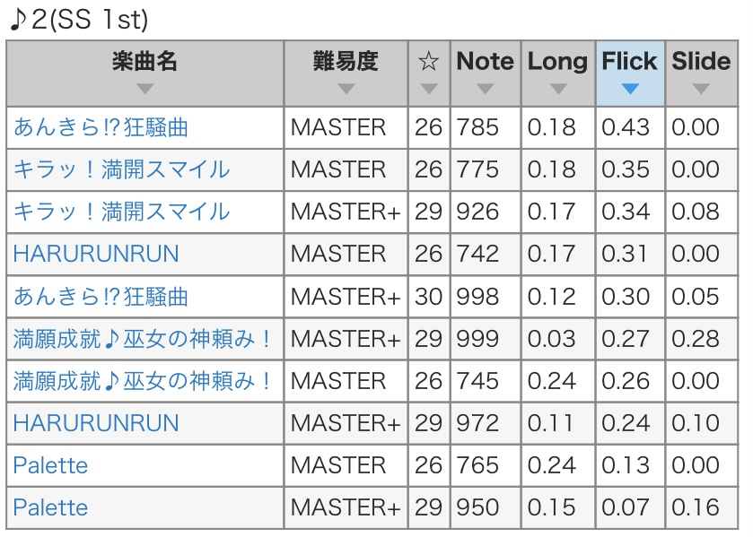
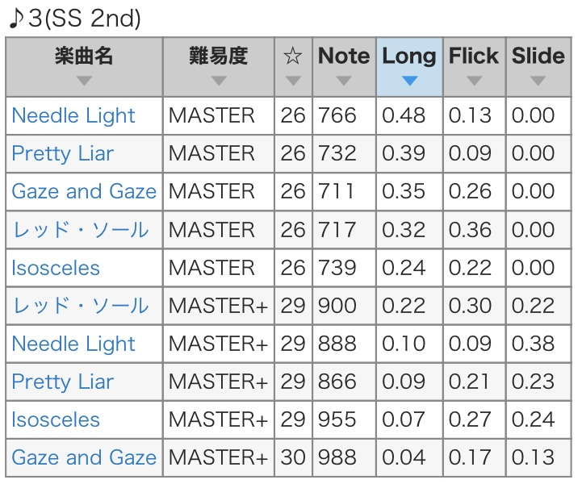

# 2023-08-31 Carnival 無限L∞PだLOVE♡
- SS ランクでの各ブースのおすすめ編成を記す
- ユニットの記述は一番上がセンター
- ゲストは 7th, 8th, 10th で使う
- マスプラ曲を考慮してない
- マイスタイルアイドルを考慮してない

# SSランク 1st ブース
特定曲＋Cuアイドル300% 
特定曲は Palette 以外はフリック多め
[check gamech.com](https://gamerch.com/imascg-slstage-wiki/entry/794176#outline__BOOTH%E4%B8%80%E8%A6%A7)
> 
- CuDa13
    - 13高ミューチャルまゆDaVi
    - 13高オルタネイトあかりDa
    - 13高アンサ智絵里Vi
    - 09高オバドラみくDa
    - 09高オバロ志希Da

# SSランク 2nd ブース
特定曲＋Coアイドル350% 
特定曲は Isosceles 以外はロング多め。
レッドソールはフリックも多め (36%)
[check gamech.com](https://gamerch.com/imascg-slstage-wiki/entry/794176#outline__BOOTH%E4%B8%80%E8%A6%A7)
> 
- CoVo09
    - 09中ミューチャル文香ViVo
    - 09中オルタネイト七海Vo
    - 09高アンサ アーニャVo
    - 07中コンボナ アーニャVo
    - 07高ロング颯Vi or 07高コンセ ライラVi

# SSランク 3rd ブース
Da のみ 560%
- 全Da09
    - 07高モチーフ凪 (09高モチーフ りあむ は 10th ブースで使いたい)
    - 09高シンフォ桃華
    - 09高シナジーはぁと
    - 09高リフレ森久保
    - 09高コンボナ菜々

# SSランク 4th ブース
Da のみ 560%
- 全Da11
    - 11高モチーフ フレ
    - 11高シンフォ小梅
    - 11高シナジー蘭子
    - 11高コンボナ桃華 周子T
    - 11高コーデ 卯月A or 周子S or 菜帆A

# SSランク 5th ブース
Vi のみ 560%
- 全Vi11 (トリコになるよう注意)
    - 11高モチーフあきら or 仁奈
    - 11高シンフォまゆ
    - 11高シナジー芳乃
    - 11高コンボナきらり or 奈緒
    - 11高コーデ雪菜 or アーニャA or 未央A

# SSランク 6th ブース
Vo 380%
- 全Vo11
    - 11高モチーフ飛鳥
    - 11高リフレ晴
    - 11高シンフォ輝子
    - 11高コンボナ愛梨
    - 11高コーデゆかり

# SSランク 7th ブース
Da 380%
- 全Da07
    - 07高モチーフ加蓮
    - 07高シンフォ藍子
    - 07高コンボナ唯
    - 07高コーデそらA
    - GGG 07高シナジー美穂

# SSランク 8th ブース
Vi 380%
- 全Vi07
    - 07高モチーフ 紗枝
    - 07高スパイク 愛海Vi
    - 07高シナジー ありす
    - 07高コンセ茜
    - GGG 07高シンフォ有香

# SSランク 9th ブース
開放されたプロデュースptにつき13%
- CoDa13
    - 13高ミューチャル奈緒VoDa
    - 13高オルタネイトアーニャDa
    - 09高オバドラ森久保Vo
    - 09高オバロ美波Vo
    - 09高アンサ アーニャVo or 颯Da or 06中アンサ奏Da

# SSランク 10th ブース
イベント出演アイドル 70%
- スタゴラPIANO特化
    - (A) PaDa09 密輸先編成
        - 12中マジック みりあDa or 唯Da or 未央Da
        - 12中アンコ SRナターリアVi(イベ出)
        - 09高モチーフ りあむDa
        - 09中オルタ 夏樹Da(イベ出)
        - 09中ミューチャル唯ViVo → 愛梨VoDa
    - (B) ブースト用 15中アンコール
        - 15中アンコ SR加蓮Vi(イベ出)
        - GGG 07高シンフォ肇Vi(イベ出)
        - 15中アンコ SRみくVi
        - 15中アンコ SRみりあVi or 07高アンサ茜Vi
        - 15中アンコ SR or 11高アンサ凪Vi
    - (C) 密輸元編成 ブーストは 4,8,10,13秒
        - 07高スライド なつっこ音頭SRみりあVoCo → 07高スライド 仁奈VoCo
        - 13高スパークル 拓海Vi
        - 08高スキブ 奏Vo
        - 10高スキブ アーニャVi
        - 10高スキブ 杏Da

